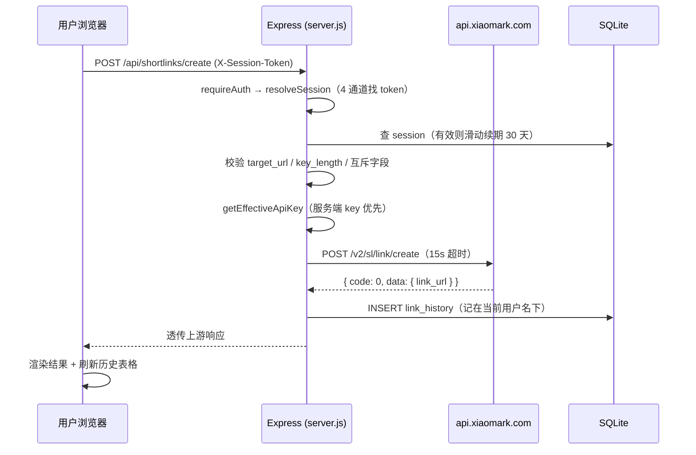
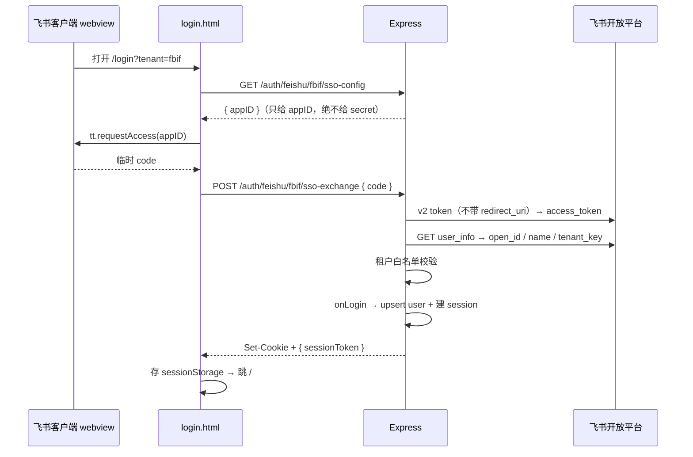
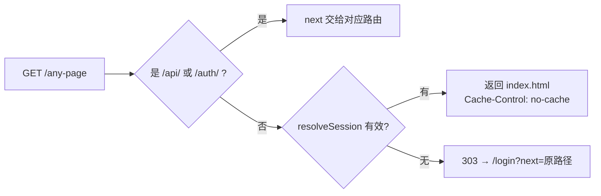

# web-short-url 架构文档

## 1. 如何阅读本文档

这份文档描述 **web-short-url**（package name: `short-url`，PM2 进程名: `web-short-url`）的真实架构——不是理想架构，是代码里现在长的样子。

- **读者**：接手这个项目的人（含 AI agent）。假设你会写代码，但没见过这个仓库。
- **顺序**：第 2～7 章是"这是个什么东西"；第 8～13 章是后端；第 14～17 章是前端；第 18 章往后是横切关注点（数据流、错误、测试、性能、安全、部署）。
- **配套**：改代码后按 [ARCHI-rules.md](ARCHI-rules.md) 判断要不要回写本文档。
- **一句话定位**：这是一个**给内部运营用的短链工具**——套在小码（Xiaomark）短链 API 外面的一层带登录的自建门面。

---

## 2. 概览

### 它解决什么问题

FBIF / 富的的运营同事要建短链、生成二维码、排查跳转链路。直接用小码官方后台有两个麻烦：
1. **API key 是共享机密**——不能发给每个人，发了就等于泄漏。
2. **谁建了哪条链接查不到**——小码后台不区分内部使用者。

本项目的做法：把 API key 锁在服务端，前端只跟自己的服务器说话；用飞书登录识别人，把每个人建的链接记在自己名下。

### 高层架构

```
浏览器（原生 JS，无框架无构建）
    │  同源 fetch，带 session token
    ▼
Express 服务器（server.js）
    ├── 飞书 OAuth 路由（lib/feishu_auth.js）── ▶ 飞书开放平台
    ├── 强制登录中间件 requireAuth
    ├── 小码 API 代理 + 内存缓存 ──────────── ▶ api.xiaomark.com
    ├── 二维码生成 / 跳转链路解析（本地）
    └── SQLite（better-sqlite3）：users / sessions / link_history
```

### 关键特征

- **强制登录**：除 `/api/health`、`/login`、`/auth/*` 外，所有路由（含静态页）都要求 session。未登录一律 303 跳 `/login`。
- **无构建步骤**：前端是浏览器直接吃的 `.html` / `.css` / `.js`，没有 webpack / vite / TypeScript。改完刷新即可。
- **单进程单文件 SQLite**：数据库就是项目目录下的 `shorturl.db`（WAL 模式），不依赖外部 DB 服务。

---

## 3. 技术栈

| 层 | 技术 | 版本 | 用途 |
|---|---|---|---|
| 运行时 | Node.js（ES Modules，`"type": "module"`） | 需支持原生 `fetch`（≥ 18） | 服务端 |
| Web 框架 | Express | ^4.21.2 | 路由与中间件 |
| 数据库 | better-sqlite3 | ^12.6.2 | 同步 SQLite 驱动，WAL 模式 |
| Cookie | cookie-parser | ^1.4.7 | 解析 session / state cookie |
| 配置 | dotenv | ^16.4.7 | `.env` 加载 |
| 二维码 | qrcode | ^1.5.4 | 服务端生成 Data URL |
| 前端 | 原生 HTML / CSS / JavaScript | — | **无框架、无构建、无打包** |
| 进程管理 | PM2（`ecosystem.config.cjs`） | — | 生产常驻，256M 内存上限重启 |
| 反向代理 | Nginx / Caddy（见 DEPLOY.md） | — | TLS 终止；服务端已开 `trust proxy` |
| CI/CD | GitHub Actions + SSH | — | push 到 `codex/short-url-ui` 自动部署 |

**上游依赖（外部服务）**
- 小码短链 API：`https://api.xiaomark.com`（接口文档已导出到 `docs/xiaomark-api/`）
- 飞书开放平台：`accounts.feishu.cn`（OAuth 授权） / `open.feishu.cn`（token / user_info）

**没有的东西**（重要，别去找）：没有测试框架、没有 lint、没有 typecheck、没有 git tag、没有 CHANGELOG。

---

## 4. 项目结构

```text
.
├── server.js                 # 873 行。Express 主文件：DB schema、session、代理、二维码、跳转解析、页面路由
├── lib/
│   └── feishu_auth.js        # 416 行。飞书单应用 OAuth 路由工厂（5 条路由）
├── public/                   # 前端静态资源（express.static 直出，index:false）
│   ├── index.html            # 269 行。主应用页（建链 + 历史）
│   ├── app.js                # 1605 行 ⚠️ 超 900 行规约。全部前端逻辑
│   ├── styles.css            # 1607 行 ⚠️ 超 900 行规约。设计系统 + 全部样式
│   ├── login.html            # 399 行。Mascot 登录页（自带内联 CSS/JS：单按钮 OAuth + 端内免登）
│   └── mascots/              # 登录页插画：door-login.webp（门+小黄人）+ fbif-logo.png
├── docs/
│   ├── ARCHI.md              # 本文档
│   ├── ARCHI-rules.md        # 何时回写本文档
│   ├── 4-unit-tests/         # 验证指南 + 覆盖债台账
│   └── xiaomark-api/         # 小码 API 官方文档导出（34 篇，只读参考）
├── scripts/
│   └── fetch_xiaomark_api_docs.py   # 抓取上面那批文档的一次性脚本
├── .github/workflows/deploy.yml     # push 即部署（含 .env v2→v3 迁移逻辑）
├── ecosystem.config.cjs      # PM2 配置（name: web-short-url, PORT 3000）
├── .env.example              # 环境变量模板
├── DEPLOY.md                 # 部署手册
├── README.md                 # 仓库说明
└── shorturl.db               # 运行时 SQLite（已 gitignore）
```

**代码分布的真相**：全部业务逻辑集中在 4 个文件——`server.js`、`lib/feishu_auth.js`、`public/app.js`、`public/login.html`。没有分层目录（没有 `routes/`、`controllers/`、`models/`）。这是刻意的小项目取舍，但 `app.js` / `styles.css` 已经越界（见第 24 章技术债）。

---

## 5. 核心架构原则

代码里体现出来的（不是纸面上的）设计取舍：

1. **API key 绝不出服务端**。所有小码调用都由 `server.js` 代发；前端连 key 都拿不到（`XIAOMARK_API_KEY` 只在服务端读）。前端表单虽保留 apikey 字段作为兜底，但服务端 key 优先（`getEffectiveApiKey`：`SERVER_API_KEY || bodyKey`）。
2. **登录是硬门槛，不是可选项**。`app.get("*")` 兜底路由会把任何未登录的页面请求 303 到 `/login`。API 路由挂 `requireAuth`。
3. **Session 走多通道，因为 cookie 在飞书里会丢**。这是本项目最反直觉的设计——见第 12 章。
4. **能在服务端做的就不在前端做**。二维码生成、跳转链路解析都在服务端，前端只拿结果。
5. **无构建**。前端保持"改完刷新就看到"的即时性，代价是没有类型检查、没有模块打包。
6. **上游元数据带缓存**。项目 / 分组 / 域名列表是低频变更的，用进程内 Map 缓存（默认 30 秒），避免每次开页面都打上游。

---

## 6. 构建系统与工具链

**没有构建。** 这不是遗漏，是设计选择。

| 命令 | 作用 |
|---|---|
| `npm install` | 装依赖 |
| `npm start` | `node server.js` |
| `npm run dev` | `node --watch server.js`（改后端自动重启） |

- **前端**：`public/` 下的文件由 `express.static` 直接吐给浏览器，没有转译、没有打包、没有压缩。
- **没有 lint / typecheck / test 命令**——`package.json` 的 `scripts` 里只有 `start` 和 `dev`。
- **生产**：`npm ci --production` + `pm2 restart web-short-url`。

---

## 7. 配置

全部通过环境变量（`.env`，dotenv 加载）。模板见 `.env.example`。

| 变量 | 必填 | 默认 | 说明 |
|---|---|---|---|
| `PORT` | 否 | `3000` | 监听端口 |
| `XIAOMARK_API_KEY` | 推荐 | 空 | 服务端小码 key。配了前端就不用填 |
| `XIAOMARK_CACHE_TTL_MS` | 否 | `30000` | 元数据缓存时长（毫秒） |
| `DEFAULT_WEBHOOK_CALLBACK_URL` | 否 | 空 | 前端"更多选项"展示用，**不会提交给小码** |
| `DEFAULT_WEBHOOK_SCENE` | 否 | 空 | 同上 |
| `FEISHU_FBIF_APP_ID` / `_SECRET` | **是** | — | 登录 App 凭证（单应用；富的走关联组织共享，无需独立凭证） |
| `FEISHU_REDIRECT_BASE` | **是** | — | 部署根 URL（不带路径），OAuth 回调拼接用 |
| `FEISHU_ALLOWED_TENANT_KEYS` | 否 | 空（=不限制） | 逗号分隔的飞书 `tenant_key` 白名单。⚠️ 要开必须同时填 FBIF 和富的两个 |

**硬编码常量**（在 `server.js` 里，改要改代码）：
- `SESSION_MAX_AGE_MS` = 30 天（滑动续期）
- `SESSION_COOKIE_NAME` = `shorturl_session`
- `XIAOMARK_API_BASE` = `https://api.xiaomark.com`
- 上游超时：元数据 10～12 秒，建链 15 秒，跳转解析 10 秒 / 最多 6 跳

**启动时的自检**：`server.js` 启动会打印 API key 是否加载、登录 App 是否就绪（`FBIF=ready`）、`FEISHU_REDIRECT_BASE` 缺失则告警。

---

## 8. API 设计

REST-ish，但不严格。约定：

- 小码代理接口一律 **POST**（跟随上游小码 API 的风格，即使是读操作）。
- 响应体透传上游格式：`{ code: 0, message: "ok", data: {...} }`，`code !== 0` 即失败。
- 本地自有接口（`/api/me`、`/api/history`）用 `{ ok: true/false, ... }` 格式。**两套格式并存**，前端要分别处理。

### 路由清单

| 方法 | 路径 | 登录 | 说明 |
|---|---|---|---|
| GET | `/api/health` | ❌ | 健康检查（部署脚本用它做验活） |
| GET | `/api/config` | ✅ | 前端配置与端点表 |
| GET | `/api/me` | ⚠️ | 登录态。`?optional=1` 时未登录返回 200 `{ok:false}` 而非 401 |
| GET | `/api/history` | ✅ | 当前用户历史（最多 500 条，倒序） |
| DELETE | `/api/history/:id` | ✅ | 删单条（带 open_id 校验，防越权） |
| DELETE | `/api/history` | ✅ | 清空当前用户历史 |
| POST | `/api/history/migrate` | ✅ | 把浏览器 localStorage 历史迁到服务端（一次最多 500 条） |
| POST | `/api/meta/projects` | ✅ | 代理小码 `/v2/sl/project/get_all`（带缓存） |
| POST | `/api/meta/groups` | ✅ | 代理小码 `/v2/sl/group/batch_get`（带缓存） |
| POST | `/api/meta/groups/create` | ✅ | 代理小码 `/v2/sl/group/create`（成功后清该项目的分组缓存） |
| POST | `/api/meta/private-domains` | ✅ | 代理小码 `/v2/sl/private_domain/get_all`（带缓存） |
| POST | `/api/shortlinks/create` | ✅ | **核心**：代理建链 + 成功后写 `link_history` |
| POST | `/api/tools/qrcode` | ✅ | 服务端生成二维码 Data URL |
| POST | `/api/tools/resolve-redirect` | ✅ | 解析跳转链路（最多 6 跳） |
| GET | `/go?url=` | ❌ | 302 重定向代理（只允许 http/https） |
| GET | `/login` | ❌ | 登录页 |
| GET | `*` | ✅ | 兜底：已登录 → `index.html`；未登录 → 303 `/login?next=...` |

飞书 OAuth 的 5 条路由（单应用）见第 11 章。

### 输入校验（`/api/shortlinks/create`）

服务端做了这些拦截，不信任前端：
- `target_url` 必须是合法 http/https URL。
- `key_length` 必须是 4～8 的整数。
- `escape_from_wechat` 和 `advanced_bot_detection` **不能同时开**（小码文档的约束）。
- 空字符串字段在发给上游前会被 `delete` 掉，避免上游把空串当有效值。
- `webhook_callback_url` / `webhook_callback_token` **强制删除**——这两个字段小码只认后台配置，前端填了也不发。

---

## 9. 请求生命周期

```
请求
 ├─ express.json({ limit: "256kb" })      解析 body
 ├─ cookieParser()                         解析 cookie
 ├─ express.static("public", index:false)  静态资源（注意 index:false，/ 不会直出 index.html）
 ├─ feishuRouter                           /auth/feishu/* 全部在这里终结
 ├─ requireAuth（逐路由挂载，非全局）        resolveSession → 401 或放行
 ├─ 业务处理器
 └─ app.get("*")                           兜底页面路由：未登录 303 /login
```

**没有全局错误中间件。** 每个 handler 自己 try/catch，统一走 `sendError(res, status, message, detail)`——`detail` 只进服务端日志，不返给客户端（符合"不向用户暴露内部错误"）。

---

## 10. 数据库层

`better-sqlite3`，**同步 API**（不是 async），WAL 模式，外键开启。DB 文件：`./shorturl.db`。

### Schema

```sql
users (
  open_id     TEXT PRIMARY KEY,   -- 注意：这是本地 ID，格式 "fbif:ou_xxx"（租户前缀 + 飞书 open_id）
  feishu_open_id TEXT,            -- 飞书原始 open_id
  name, avatar_url, tenant,       -- tenant：v0.2.0 起新登录恒为 'fbif'（单应用路由标记，不再代表企业）
  tenant_key, union_id, user_id, email,  -- tenant_key 才是真正区分企业的字段（老库 tenant 可能残留 'fude'/''）
  created_at, updated_at
)

sessions (
  token      TEXT PRIMARY KEY,    -- 32 字节随机 hex
  open_id    TEXT → users.open_id,
  expires_at TEXT,                -- 30 天，每次访问滑动续期
  created_at
)

link_history (
  id INTEGER PK AUTOINCREMENT,
  open_id TEXT → users.open_id,
  link_url, target_url, name, domain, group_id, group_name,
  created_at
)
```

### 关键设计：租户命名空间

**`users.open_id` 不是飞书的 open_id。** 它是 `${tenant}:${feishu_open_id}`（见 `localUserId()`）。原因：FBIF 和富的是两个独立飞书应用，理论上 open_id 可能撞车；加租户前缀保证全局唯一。飞书原始 ID 单独存在 `feishu_open_id` 列。

### 迁移机制

`server.js` 启动时跑两段迁移，**幂等，无版本表**：
1. **加列**：`PRAGMA table_info(users)` 检查，缺哪列补哪列（双租户改造时加的 6 个列）。
2. **改主键**：`migrateLegacyUserIds()`（一个 transaction）把老的裸 open_id 用户迁成 `tenant:open_id` 命名空间，同时把 `sessions` 和 `link_history` 的外键一起搬过去，最后删掉老行。

这套迁移每次启动都跑，靠 SQL 的 WHERE 条件保证只处理未迁移的行。**没有 migration 版本号——改 schema 要自己保证幂等。**

---

## 11. 认证与授权（飞书单应用统一登录）

这是本项目最复杂的部分，全部在 `lib/feishu_auth.js`（416 行），通过 `createFeishuRouter({ onLogin, onLogout })` 注入回调，`server.js` 负责建用户和发 session。

### 单应用模型（v0.2.0 起）

**只有一个飞书 App（FBIF App），富的员工经飞书后台的「关联组织应用共享」走同一个 App 登录。** FBIF 和富的员工看到的是同一个登录页、点的是同一个按钮，系统靠 `user_info` 返回的 `tenant_key` 在后台区分身份（富的员工登录后 `tenant_key` 仍是富的自己的）。

> 历史：v0.1.x 曾是「双 App 双按钮」——FBIF 和富的各一个独立 App，登录页两个按钮 + 扫码 Tab。v0.2.0 迁移到单应用，砍掉富的 App、扫码链路、租户选择。迁移的完整权衡与踩坑见 `docs/1-plans/F_0.2.0_feishu-single-app-mascot-login.plan.md`。

### 两条登录链路

| 链路 | 触发场景 | 飞书接口 | 说明 |
|---|---|---|---|
| **SSO 免登** | 在飞书客户端里打开页面 | `tt.requestAccess`（失败降级 `tt.requestAuthCode`）+ v2 token（**不带 redirect_uri**） | 主链路。用户零点击 |
| **OAuth 按钮** | 普通浏览器点「使用飞书登录」 | `accounts.feishu.cn/authorize` + v2 token（带 redirect_uri） | 降级链路 |

**路由：4 条在 `/auth/feishu/fbif/*`（`login` / `callback` / `sso-config` / `sso-exchange`）+ 1 条共享 `POST /auth/feishu/logout`（不带 fbif 段）= 5 条。**

⚠️ **v1 token 函数仍保留**（`getAppAccessToken` / `exchangeCodeV1`）——SSO 免登的 `requestAuthCode` 降级路径在用它们（老版飞书客户端 `requestAccess` 返回 errno 103 时降级）。看着像"只有扫码用"，其实删了会让端内免登在老客户端上挂掉。

### state 防 CSRF：签名 + cookie 双保险

标准做法是把 state 存 cookie 比对。但**飞书 webview 和某些客户机会丢 cookie**，纯 cookie 方案会导致合法用户登不进去。本项目的做法（`checkState`）：

1. **state 本身是 HMAC 签名的**（`signState` / `verifyState`）——payload 含租户、模式、nonce、10 分钟过期，用 App Secret 派生的密钥签。签名过不了 → 拒绝。
2. **cookie 是附加校验，不是必需**：有 cookie 但和 state 不一致 → 判定攻击，拒绝；**没有 cookie → 放行**（签名已经保护了身份）。

⚠️ 签名密钥派生自 `FEISHU_FBIF_APP_SECRET`——换 secret 会让所有在途 state 失效（10 分钟窗口，重试即可）。

### 租户白名单

`FEISHU_ALLOWED_TENANT_KEYS` 为空时**不限制**（任何飞书租户的用户都能登）。要收紧就填 `tenant_key`。⚠️ **单应用下 FBIF 和富的是两个不同 tenant_key，要开白名单必须两个都填**，只填一个会把另一家全部 403 拦掉。

---

## 12. Session 的多通道兜底（本项目最反直觉的设计）

**问题**：飞书 webview / 隐私浏览器 / 某些客户电脑会丢 cookie。只靠 HttpOnly cookie，用户登录后一刷新就掉登录态。

**解法**：session token 同时走 4 条通道，服务端按顺序找（`extractSessionTokens`）：

1. `shorturl_session` cookie（标准通道，HttpOnly）
2. `X-Session-Token` 请求头 ← **前端主力兜底**
3. `Authorization: Bearer <token>`
4. `?session_token=` query（最后兜底）

**前端怎么配合**（`public/app.js` 开头 50 行）：
- 登录成功后服务端 302 到 `/#session_token=xxx`（URL hash 兜底）。
- 前端启动**立刻**消费 hash → 存 `sessionStorage` → 清理地址栏。
- **猴补丁 `window.fetch`**：所有同源请求自动带上 `X-Session-Token` 头。

**滑动续期**：`resolveSession` 每次解析成功就把 `expires_at` 推到 now + 30 天。所以活跃用户永不掉线。

⚠️ **改 auth 相关代码前必读本章**——不理解这套兜底就动 cookie 逻辑，会让飞书端内用户全部登不进去。

---

## 13. 上游代理与缓存层

### 代理

`postXiaomark(pathname, payload, timeoutMs)` 是所有上游调用的唯一出口：
- `AbortController` 超时（默认 15 秒）。
- 上游返非 JSON → 包装成 `{ code: -1, message: "Non-JSON response from upstream", raw }`，不让它炸。
- 超时 → 前端收到 504；其他异常 → 500。

### 缓存

进程内 `Map`，**不是 LRU、不限容量、进程重启即清空**。

- **缓存谁**：projects / groups / private-domains（低频元数据）。**建链、二维码、跳转解析不缓存。**
- **key**：`${类型}:${apikey 的 sha1 前 8 位}:${payload JSON}` —— 按 API key 隔离，不同 key 不串数据。
- **TTL**：`XIAOMARK_CACHE_TTL_MS`，默认 30 秒。惰性过期（读的时候才检查并删）。
- **只缓存成功响应**（`upstream.ok`）。
- **主动失效**：创建分组成功后，遍历删掉该 API key + 该项目的分组缓存——保证新建的分组立刻可见。
- 响应里带 `_meta.cache: "hit" | "miss"`，方便排查。

⚠️ 缓存 Map 无上限。API key 固定的情况下 key 数量有界（项目数 × 分组查询），不会无限增长；但如果改成"每用户自带 key"，需要重新评估。

---

## 14. 前端页面与 UI 架构

**两个页面，各自独立，不共享 JS：**

| 页面 | 文件 | 特点 |
|---|---|---|
| 登录页 | `public/login.html`（399 行） | **完全自包含**：CSS 内联在 `<style>`，JS 内联在 `<script>`。不依赖 app.js / styles.css |
| 主应用 | `public/index.html` + `app.js` + `styles.css` | 建链表单 + 结果区 + 历史表格 |

### 登录页 = Mascot 版（v6，v0.2.0 起）

FBIF 品牌 Mascot 登录页：≥1024px 双栏卡片（左=门+小黄人插画 `mascots/door-login.webp`，右=表单），窄屏单栏（插画隐藏）。右栏是 FBIF logo + 副标题「短链工具」+ **一个**「使用飞书登录」胶囊按钮（飞书三色 inline SVG）+ 错误条。**没有第二个按钮、没有扫码、没有教程链接**——富的员工点同一个按钮登录。

- 视觉源真相：`~/.claude/skills/feishu-login-guide/templates/frontend/react-vite/MascotLogin.tsx.template`（React/Tailwind）。本项目无 React，是**手工翻译成原生 HTML/CSS**，视觉值 1:1 对齐。
- 两张位图在 `<head>` preload（插画带 `media="(min-width:1024px)"`），让图与 JS 并行下载。
- ⚠️ **插画用绝对定位铺满**（`position:absolute; inset:0`）：grid 拉伸出的高度对 `height:100%` 不算"确定高度"，会让图塌成 0 高露出底色。这是翻译 Tailwind `size-full` 时的坑。
- 保留两段关键 JS：`trySsoLogin()`（端内免登，租户锁 fbif）+ `checkAlreadyLoggedIn()`（消费 `#session_token` hash → sessionStorage → 清地址栏）。

### 为什么登录页是自包含的

登录页要在飞书 webview 里尽可能快地跑 SSO——少一个外部请求就少一次失败机会。代价是登录页的样式和主应用的设计系统**是两份**，改主题要改两处。

### 主应用的结构（无框架，靠 DOM 直接操作）

`app.js` 是一个大 IIFE 风格的脚本，没有模块划分。功能块靠注释分区：

```
Session bootstrap（hash → sessionStorage → fetch 猴补丁）
Auth / App 元素引用（一堆 const el = document.getElementById）
工具函数（escapeHtml / formatDateTime / safeLocalStorage...）
Server History（加载 / 删除 / 清空 / 从 localStorage 迁移）
渲染层（renderHistoryTable / renderDashboardStats / renderQrModalState）
业务动作（generateQrForUrl / resolveRedirectForUrl / copyText）
元数据加载（loadProjects / loadGroups / loadDomains）
表单（collectPayload / validatePayload / handleSubmit）
分组弹窗（openGroupModal / handleCreateGroup）
事件绑定（wireEvents / bindDashboardEvents）
Auth flow（checkSession / showLoggedIn / redirectToLogin）
```

⚠️ 1605 行、无模块化，**已超项目 900 行规约**（见第 24 章）。

---

## 15. 前端状态管理

**没有状态管理库。** 三处状态源：

1. **模块级变量**（`app.js` 里的 `let`）——当前项目、分组列表、历史数组、最新生成的链接等。刷新即丢。
2. **`localStorage`**（`LS_KEYS`）——API key（若前端填）、webhook 展示值、**老版本的浏览器历史**。
3. **`sessionStorage`**——session token（多通道兜底的载体）。
4. **服务端 SQLite**——登录用户的历史记录（真相源）。

### 历史记录的迁移逻辑

老版本历史存在 `localStorage`。强制登录后，`migrateLocalStorageHistory()` 会把本地历史 POST 到 `/api/history/migrate` 搬到服务端，然后清本地。**这是一次性迁移**——新建的链接由服务端在建链成功时直接落库（`/api/shortlinks/create` 里 `stmtInsertHistory.run`），前端不再写本地历史。

---

## 16. 样式架构

`public/styles.css`（1607 行），设计系统叫 **"Cold Gray Minimal"**。

- **CSS 自定义属性**（`:root`）定义全部 token：背景 / 表面 / 文字 / 强调色 / 语义色（success / warning / danger / purple）/ 线条 / 圆角 / 阴影 / 字体。**改主题只改 `:root`。**
- 主色 `--accent: #2563eb`（蓝），字体 Inter + JetBrains Mono。
- 按注释分区：Login Gate / Topbar / Shell / Create Card / Split Button / Result / History / Inputs / Buttons / Table / Modal…
- **没有 CSS 框架**（无 Tailwind / Bootstrap），没有预处理器，没有 CSS Modules。
- 响应式靠 `@media` 手写断点，移动端做过专门优化（提交历史里有 "Improve mobile UX"）。

⚠️ 1607 行单文件，**已超 900 行规约**。

---

## 17. 前端与 API 的集成

- 统一入口 `postJSON(url, body)`：`fetch` + JSON + 错误抛出。
- **fetch 被猴补丁过**（见第 12 章）——同源请求自动加 `X-Session-Token`。
- 前端从 `/api/config` 拿端点表和默认值，**不硬编码 API 路径**（`endpoints.createLink` 等）。
- 401 处理：`checkSession()` 失败 → `redirectToLogin()` 跳 `/login`。

---

## 18. 数据流图

### 建链主流程



### 飞书端内免登（SSO）流程



### 未登录访问任意页面



---

## 19. 错误处理策略

| 层 | 做法 |
|---|---|
| 上游超时 | `AbortError` → 504 `"Upstream request timeout"` |
| 上游非 JSON | 包成 `{ code: -1, message: "Non-JSON response from upstream" }` |
| 上游业务失败 | 透传上游 `code` / `message` 给前端 |
| 参数非法 | 400 + 明确的中文/英文原因 |
| 未登录 | API → 401 `{ code: -1, message: "未登录" }`；页面 → 303 `/login` |
| 服务端异常 | 500，**内部细节只进 `console.warn`，不返客户端**（`sendError` 的 `detail` 参数） |
| OAuth 失败 | 一律 302 回 `/login?error=<原因>`，登录页据此显示 banner（`config` / `state` / `denied` / `no_code` / `token` / `unauthorized_tenant`） |

**没有全局 error middleware**——每个 handler 自己兜。新增路由时**必须自己加 try/catch**，否则异常会冒泡成 Express 默认 HTML 错误页（会泄漏栈）。

---

## 20. 测试策略

**现状：没有自动化测试。** 诚实地说清楚：

- ❌ 无单元测试框架（package.json 里没有 test 脚本）
- ❌ 无 lint / typecheck
- ✅ **有手工 UI 验证的痕迹**：`screenshots/`（30 张截图）和 `.playwright-mcp/`（页面快照 + console 日志）说明 UI 改动是靠 Playwright 驱动真实浏览器验证的
- ✅ **有部署验活**：GitHub Actions 部署后 `curl -sf http://127.0.0.1:3000/api/health`，失败即 exit 1

**建议的测试优先级**（见 `docs/4-unit-tests/TESTING.md`）：纯函数（`parseHttpUrl` / `verifyState` / `cleanOptionalString`）→ 缓存逻辑 → 路由集成测试 → UI 端到端。

---

## 21. 性能考量

- **元数据缓存**：30 秒 TTL 的进程内缓存，避免每次开页面打 4 次上游。
- **SQLite prepared statements**：全部 SQL 在启动时 `db.prepare()` 一次，复用。better-sqlite3 是同步的——**单条查询极快（微秒级），但大批量循环会阻塞事件循环**。历史迁移用 `db.transaction()` 包住，500 条上限。
- **历史查询封顶 500 条**（`LIMIT 500`），前端表格不分页。
- **PM2 内存上限 256M** 自动重启。
- **无 gzip / 无 CDN / 无静态资源版本号**——HTML 显式 `Cache-Control: no-cache`（防部署后拿到旧页面），但 CSS/JS 走 express.static 默认缓存策略，**改前端后用户可能拿到旧的 app.js**（潜在坑，见第 24 章）。

---

## 22. 安全考量

**已做的：**

| 威胁 | 缓解 |
|---|---|
| API key 泄漏 | key 只在服务端；`/api/sso-config` 只暴露 appID 不暴露 secret |
| CSRF（OAuth） | HMAC 签名 state（10 分钟过期 + nonce）+ cookie 附加校验 |
| Session 劫持 | HttpOnly + `secure`（跟 `req.secure`，已开 `trust proxy`）+ SameSite=Lax；token 是 32 字节 CSRF 随机数 |
| 越权删历史 | `DELETE FROM link_history WHERE id = ? AND open_id = ?`——带用户 ID 条件 |
| XSS | 前端渲染历史时走 `escapeHtml()` |
| SSRF / 开放重定向 | `/go` 和所有 URL 入参强制 `parseHttpUrl`（只允许 http/https 协议） |
| 未授权租户 | `FEISHU_ALLOWED_TENANT_KEYS` 白名单（默认关闭） |
| 大 body 攻击 | `express.json({ limit: "256kb" })` |

**已知弱点 / 需要留意：**

- 🔸 **签名密钥派生自 App Secret**——换 secret 会让所有在途 state 失效（可接受），但也意味着 secret 泄漏 = state 可伪造。
- 🔸 **state cookie 缺失时放行**（第 11 章）——这是为了兼容飞书 webview 的刻意取舍，安全性靠 HMAC 签名兜底。
- 🔸 **`?session_token=` query 通道**——token 会进 URL、可能被日志/Referer 记录。这是最后兜底通道，非必要不用。
- 🔸 **`FEISHU_ALLOWED_TENANT_KEYS` 默认为空 = 任何飞书租户都能登**。生产环境应该填。
- 🔸 **SSRF 只挡协议不挡内网 IP**——`/go` 和 `resolve-redirect` 可以打内网地址（`http://192.168.x.x`）。当前是内部工具、部署在受控环境，风险可接受；如果对外开放需要加内网 IP 黑名单。

---

## 23. 部署

**生产地址**：`https://shorturl.garyzheng.com`

**部署链路**（`.github/workflows/deploy.yml`）：

```
push 到分支 codex/short-url-ui
  → GitHub Actions
  → SSH 到生产机
  → git pull
  → .env 迁移（v2 单租户 → v3 双租户，幂等，自动备份 .env.bak.*）
  → npm ci --production
  → pm2 restart web-short-url
  → curl /api/health 验活（失败 exit 1）
```

⚠️ **主分支就是 `codex/short-url-ui`**（不是 main）——push 即上生产，没有 staging。

**手工部署**（DEPLOY.md）：
```bash
npm ci
pm2 start ecosystem.config.cjs --env production
pm2 save
```

前面挂 Nginx / Caddy 做 TLS 终止。服务端已 `app.set("trust proxy", 1)`，所以 `req.secure` 能正确反映 `X-Forwarded-Proto`（cookie 的 `secure` 标志依赖它）。

---

## 24. 已知技术债

诚实清单，改代码时心里有数：

| # | 问题 | 影响 | 位置 |
|---|---|---|---|
| 1 | `public/app.js` 1605 行、`public/styles.css` 1607 行 | **超项目 900 行规约**，改动风险高、review 困难 | `public/` |
| 2 | 零自动化测试 | 每次改动只能靠手工 UI 验证 | 全局 |
| 3 | 两套响应格式并存（`{code,message,data}` vs `{ok}`） | 前端要分别处理，容易漏 | `server.js` |
| 4 | 登录页样式与主应用设计系统是两份 | 改主题要改两处 | `login.html` vs `styles.css` |
| 5 | 静态资源无版本号/hash | 部署后用户可能拿到缓存的旧 `app.js`（HTML 已 no-cache，JS/CSS 没有） | `express.static` |
| 6 | DB 迁移无版本表 | 每次启动全量跑，靠 SQL 条件幂等；schema 再演进会越来越脆 | `server.js:53-127` |
| 7 | 缓存 Map 无容量上限 | 当前 key 有界所以安全；改成多用户各自 key 就有内存风险 | `server.js:189` |
| 8 | 无全局错误中间件 | 新路由忘了 try/catch 会泄漏栈 | `server.js` |
| 9 | `FEISHU_ALLOWED_TENANT_KEYS` 默认不限制 | 任何飞书租户用户都能登进来 | `lib/feishu_auth.js` |
| 10 | **单应用迁移（v0.2.0）后，富的登录从未真人验证** | 关联组织共享是否生效未知；富的现 0 用户 0 历史，即时影响为 0，但共享若没生效则富的登不进。验证顺延到富的实际要用时（见 F_0.2.0 计划门槛②） | `lib/feishu_auth.js` |
| 11 | **富的迁移的 open_id 陷阱** | 飞书 open_id 是 App 维度的。将来若富的**已有用户**再从别的 App 迁到本 App，会拿到全新 open_id → 认不出老用户 → 历史丢。迁移前必须用 email/union_id 做身份映射，不能直接切 | `server.js`（`localUserId`） |

---

## 25. 结论：关键架构决策

如果你只记三件事：

1. **登录是硬门槛，而且 session 走 4 条通道**——因为飞书 webview 会丢 cookie。动 auth 前先读第 11、12 章，否则会让端内用户全部登不进去。
2. **API key 永远不出服务端**——所有小码调用都由 `server.js` 代发。这是整个项目存在的理由，别破坏它。
3. **前端无构建、无框架、无测试**——改完刷新就能看。代价是没有类型保护，UI 改动必须用真实浏览器验证（这也是 `screenshots/` 和 `.playwright-mcp/` 存在的原因）。
