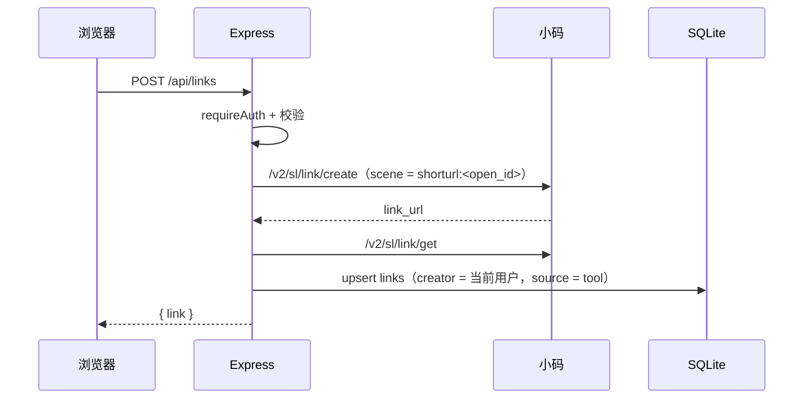
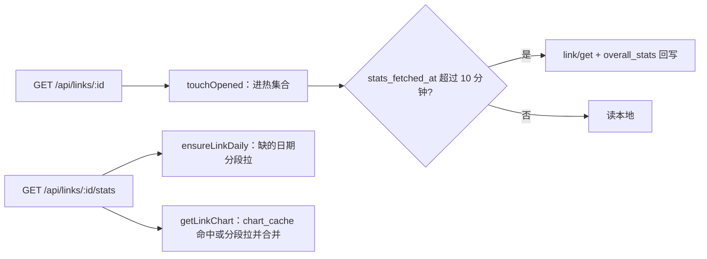

# web-short-url 架构文档

## 1. 如何阅读本文档

描述 **web-short-url**（package `short-url`，PM2 进程 `web-short-url`）在 v0.3 之后的真实架构。读者是接手的人或 AI agent。第 2～7 章讲这是什么；第 8～13 章后端；第 14～17 章前端；第 18 章起是数据流、错误、测试、安全、部署、技术债。改完代码按 [ARCHI-rules.md](ARCHI-rules.md) 判断要不要回写。

一句话定位：**套在小码（Xiaomark）团队账号外面的短链工作台**。小码负责跳转和原始统计，本项目负责身份、归属、镜像和可视化。

---

## 2. 概览

### 解决什么问题

小码后台不区分内部使用者，API key 是团队级机密，统计只能逐条看、只保留一年。本项目：飞书登录识别人；服务端持有 key；把账号里全部短链和统计镜像到本地，做列表、归属、仪表盘；本地保存的每日数据不受小码一年保留期限制。

### 高层架构

```
浏览器（React 19 / Vite / Tailwind v4 / Su Design 组件，web/）
    │ 同源 fetch：cookie 或 X-Session-Token
    ▼
Express（server.js）
    ├── lib/feishu_auth.js   飞书 OAuth / 端内 SSO（不变）
    ├── lib/api.js           业务 API：读本地镜像；写操作先打小码再回写
    ├── lib/sync.js          同步引擎：盘点 / 分层累计 / 按需每日与多维 / webhook 事件
    ├── lib/xiaomark.js      小码 V2 客户端：并发 2、退避重试、熔断、计数
    └── lib/db.js            SQLite（better-sqlite3，WAL）+ 版本化迁移
```

### 关键特征

- **强制登录**：除 `/api/health`、`/login`、`/auth/feishu/*`、`/go`、`/api/webhooks/xiaomark` 外全部要求 session；页面未登录 303 到 `/login`。
- **读写分离**：所有列表与统计读本地库；只有建链 / 编辑 / 暂停 / 恢复 / 建分组 / 改组名直接打小码，成功后回写本地。
- **单进程**：同步引擎用定时器跑在 Express 进程里，PM2 必须保持 `instances: 1`。

---

## 3. 技术栈

| 层 | 技术 | 说明 |
| --- | --- | --- |
| 运行时 | Node.js ≥ 20（生产 20.20，本机 22） | ES Modules |
| Web | Express 4 | 路由、静态托管、SPA 回退 |
| 数据库 | better-sqlite3 12，WAL | 单文件 `shorturl.db`（`DB_PATH` 可改） |
| 前端 | React 19、Vite 6、TypeScript strict、Tailwind v4、`@su/*` 组件（shadcn registry） | 构建产物 `web/dist` |
| 图表 | Su Design 的 `line-chart` / `bar-chart` / `donut-chart` / `sparkline`（React + SVG，d3-array / d3-shape） | 不用整套图表库 |
| 测试 | `node:test` | `npm test` |
| 真实浏览器走查 | Playwright 驱动本机 Chrome（`web/scripts/ui-check.mjs`） | 截图进 `web/.ui-check/` |
| 进程 / 代理 | PM2、Caddy | 服务器 121.40.214.5，端口 3010 |
| CI/CD | GitHub Actions：CI 构建前端并打源码包 → scp 到暂存目录 → 服务器解压重启 | 分支 `main` |

上游：`https://api.xiaomark.com`（文档快照 `docs/xiaomark-api/`，2026-02-24）、飞书开放平台。

---

## 4. 项目结构

```text
.
├── server.js                 Express 装配：配置、session、飞书路由、工具接口、/go、静态与 SPA 回退、同步启动
├── lib/
│   ├── db.js                 openDatabase / migrate（版本 1~3）/ statementCache
│   ├── xiaomark.js           createXiaomarkClient、XiaomarkError、splitDateRange
│   ├── sync.js               createSyncEngine（盘点、累计分层、每日 / 多维缓存、事件、调度、状态）
│   ├── api.js                createApiRouter（全部 /api 业务路由 + webhook）
│   └── feishu_auth.js        飞书单应用 OAuth / SSO（未改）
├── scripts/
│   ├── sync.mjs              运维：inventory | inventory-full | totals | tick | status
│   ├── dev-session.mjs       本地调试：造测试用户与 session
│   └── fetch_xiaomark_api_docs.py
├── test/                     node:test：xiaomark / db / sync
├── web/                      前端工程（独立 package.json）
│   ├── src/main.tsx          路由（懒加载）、Provider
│   ├── src/app/              shell（左侧导航栏 + 主区）、bootstrap 上下文
│   ├── src/pages/            links / link-detail / overview / groups / group-detail / settings
│   ├── src/components/       create-link、link-actions、stats-panel、qr-dialog、range-control
│   ├── src/lib/              api.ts（类型 + 调用）、session.ts、format.ts
│   ├── src/components/ui/    @su 组件源码（CLI 拉取，不手改）
│   ├── src/styles/           ds-tokens.css / ds-theme.css（@su/theme）
│   └── scripts/ui-check.mjs  真实浏览器走查
├── public/                   login.html + mascots/（登录页仍是自包含静态页）
├── docs/                     本文档、测试说明、小码 API 快照
├── .github/workflows/deploy.yml
├── ecosystem.config.cjs      PM2（PORT 3010）
└── .env.example
```

---

## 5. 核心架构原则

1. **本地镜像是真相的缓存，小码是真相。** 列表与统计都读本地，但每条数据都带 `fetched_at` / `last_synced_at`，界面上能看到「数据更新于」。
2. **历史日期不可变。** 每日数据与多维分布一旦拉过就永久缓存，只有今天和昨天按 TTL 刷新；这让 90 天视图第二次打开不花一次上游调用。
3. **调用量按热度分层。** 累计数据不是全量刷新，而是热 / 新 / 温 / 冷四层各自批量，摊到全天。
4. **归属在我方。** 小码没有成员级 API，创建者、认领、分组归属都只存在本地库；本工具建的短链把 `webhook_scene` 写成 `shorturl:<飞书 open_id>`，丢库也能从小码恢复归属。
5. **权限按对象。** 能管理一条短链 = 管理员 ∨ 创建者 ∨ 所在分组的归属人；谁都能看团队全部数据。
6. **前端只拼 Su Design 组件**，不写色值、尺寸、圆角；视觉问题回 Su Design 改组件。

---

## 6. 构建与工具链

| 命令 | 作用 |
| --- | --- |
| `npm start` / `npm run dev` | 后端（dev 为 `node --watch`） |
| `npm test` | `node --test`，跑 `test/*.test.js` |
| `npm run build:web` | `web/`：`tsc --noEmit` + `vite build` → `web/dist` |
| `npm run sync <cmd>` | 同步运维脚本 |
| `cd web && npm run dev` | Vite 开发服务器 5174，代理 `/api` `/auth` `/go` `/login` `/mascots` 到 3000 |
| `npx shadcn@latest add @su/<name>`（在 `web/`，需 `SU_API_KEY`） | 拉取 / 更新 Su Design 组件 |

生产不在服务器上构建前端：CI 构建后把 `web/dist` 复制过去。

---

## 7. 配置

见 `.env.example`。新增于 v0.3：`SYNC_ENABLED`、`SYNC_TICK_MS`、`SYNC_CONCURRENCY`、`SYNC_INITIAL_DELAY_MS`、`XIAOMARK_WEBHOOK_TOKEN`、`WEBHOOK_RELAY_URL`、`ADMIN_FEISHU_OPEN_IDS`、`DB_PATH`、`ALLOWED_GO_HOSTS`。已移除：`XIAOMARK_CACHE_TTL_MS`、`DEFAULT_WEBHOOK_CALLBACK_URL`、`DEFAULT_WEBHOOK_SCENE`（生产 `.env` 里残留无害）。

硬编码：session 30 天滑动续期；cookie 名 `shorturl_session`；小码 base `https://api.xiaomark.com`；每日 / 多维当天 TTL 10 分钟；上游超时 15 秒。

---

## 8. API 设计

统一响应 `{ ok: true, data }` / `{ ok: false, error: { code, message } }`；小码错误透传为 `xiaomark_<code>`。路由清单见 README「API」。鉴权分三档：

| 档 | 路由 |
| --- | --- |
| 公开 | `/api/health`、`/api/webhooks/xiaomark`（验签）、`/go`（域名白名单）、`/login`、`/auth/feishu/*` |
| 登录 | 其余 `/api/*` 与页面 |
| 管理员 | `/api/admin/*`、`PATCH /api/groups/:id`、`GET /api/groups/:id/stats`（分组每日数据含所有人的短链）、认领与改派 `POST /api/links/:id/claim` |

可见与可改（2026-10-08 用户裁定）：管理员看全部；其他人只看、只改自己创建的短链（`creator_open_id = 本人`）。`lib/api.js` 里 `canView` / `canManage`（两者相同）与 `visibleSql(session, scope)`：
- 列表、7 日趋势、概览（KPI、每日序列、最近事件）、分组汇总都按它过滤；成员传 `scope=all` 也只得到自己的。成员的概览序列逐条算自己的短链（不用分组每日数据），不给较上期。
- 详情、统计、访问记录、改、暂停 / 恢复：看不到的一律 404「短链不存在」，不暴露有没有这条。
- 分组汇总对成员只算自己的短链、只列有自己短链的分组；分组每日统计只给管理员。
- 守护测试：`test/visibility.test.js`（去掉限制时 7 项里 5 项会失败）。

管理员 = `users.role = 'admin'` 或 `feishu_open_id ∈ ADMIN_FEISHU_OPEN_IDS`；登录时若在环境变量名单里会把 `role` 持久化成 `admin`。

### 每月额度

`usageOf(open_id)`（`lib/api.js`）：本月（北京时间 1 日 0 点起）`links` 里 `creator_open_id = 本人 AND source = 'tool'` 的条数；认领来的不算。`POST /api/links` 先查额度，用完返回 403 `quota_exceeded`，前端弹「本月额度已用完」并给出可复制的申请文案。上限 = `users.monthly_quota` 或 `DEFAULT_MONTHLY_QUOTA`（默认 100），管理员在设置页用 `PATCH /api/users/:openId` 调整。

### 建链输入校验

目标必须 http/https；分组必填；自定义后缀 `[A-Za-z0-9_-]{1,32}`；随机长度 4~8；「微信内强制浏览器打开」与「深度过滤机器访问」互斥；webhook 开启时场景值固定写 `shorturl:<open_id>`。

---

## 9. 请求生命周期

```
express.json(256kb) → cookieParser → feishuRouter(/auth/feishu/*)
 → /api/me /api/health → 工具接口(qrcode / resolve-redirect) → /go
 → /api (createApiRouter：每条路由 requireAuth → wrap try/catch)
 → /login(静态) → /mascots → web/dist 静态（/assets 不可变缓存一年）
 → app.get("*")：未登录 303 /login?next=；已登录送 web/dist/index.html（no-cache）
```

`wrap()` 统一兜异常：`XiaomarkError` 透传 code 与 message，其余 500 只进日志。

---

## 10. 数据库层

迁移在 `lib/db.js` 的 `MIGRATIONS`，`schema_migrations` 记账，每步仍写成幂等。

| 版本 | 内容 |
| --- | --- |
| 1 | 旧表 users / sessions / link_history + 兼容列 + 租户命名空间迁移（原 server.js 逻辑原样搬入） |
| 2 | `users.role`；`xm_projects`、`xm_groups`、`links`、`link_stats_daily`、`group_stats_daily`、`chart_cache`、`visit_events`、`sync_runs`、`sync_state`、`user_settings` |
| 3 | 合并裸 open_id 重复用户到 `fbif:` 前缀行（搬 sessions / link_history / links / xm_groups 外键）；`link_history` 并入 `links`（source `tool`，保留创建者） |
| 4 | `users.monthly_quota`（NULL = 用 `DEFAULT_MONTHLY_QUOTA`） |

### 关键表

```sql
links (
  id PK, link_url UNIQUE, domain, key, project_id, group_id, name, target_url, create_time(unix 秒),
  escape_from_wechat, advanced_bot_detection, webhook, webhook_scene, suspended, banned,
  creator_open_id → users, source ('xiaomark' | 'tool' | 'claimed'), claimed_at,
  first_seen_at, last_synced_at, missing_since,                 -- missing_since：上游已不存在
  visit_count, visitor_count, ip_count, stats_fetched_at,       -- 累计数据快照（排除机器访问口径）
  last_opened_at                                                -- 详情页打开时间，进热集合
)
xm_groups (id PK, project_id, name, total_links, create_time, owner_open_id → users, synced_at, missing_since)
link_stats_daily (link_id, date, visit_count, visitor_count, ip_count, fetched_at, PK(link_id, date))
group_stats_daily (group_id, date, 五个计数, fetched_at, PK(group_id, date))
chart_cache (scope, scope_id, start_date, end_date, exclude_bot, payload JSON, fetched_at)
visit_events (record_id PK, link_url, link_id, visit_time, ip, ua, referer, 地域, 设备, is_robot, source, received_at)
sync_runs (job, started_at, finished_at, ok, items, calls, error)   sync_state (key, value)
user_settings (open_id PK, default_domain, default_group_id, exclude_bot)
```

`users.open_id` 仍是 `fbif:<飞书 open_id>` 命名空间；企业归属看 `tenant_key`。

---

## 11. 认证与授权（飞书单应用）

`lib/feishu_auth.js` 未改：4 条 `/auth/feishu/fbif/*` + `POST /auth/feishu/logout`；OAuth 按钮链路与端内 `tt.requestAccess` 免登链路；HMAC 签名 state，cookie 缺失放行。`server.js` 的 `onLogin` 多做一件事：按 `ADMIN_FEISHU_OPEN_IDS` 写 `role`。登录页仍是 `public/login.html`，React 应用不包含登录页。

---

## 12. Session 多通道

不变：cookie `shorturl_session` → `X-Session-Token` → `Authorization: Bearer` → `?session_token=`，30 天滑动续期。前端 `web/src/lib/session.ts` 启动时消费 `#session_token` 存 `sessionStorage`（键名与 login.html 一致：`shorturl_session_token`），`sessionFetch` 自动带头；401 一律跳 `/login?next=`。

---

## 13. 小码客户端与同步引擎

### 客户端（`lib/xiaomark.js`）

- 队列 + 并发上限（默认 2）+ 最小间隔 60ms；超时 15 秒。
- 重试：网络错误、超时、HTTP 429 / 5xx、返回码 -1 / -2 → 指数退避最多 3 次；业务错误（1、3330、3331…）不重试。
- 熔断：连续 5 次最终失败 → 暂停 60 秒，期间调用立即拒绝（`status 503`）。
- `stats()` 暴露调用 / 成功 / 失败 / 重试 / 暂停时间，管理页展示。

### 同步引擎（`lib/sync.js`）

| 任务 | 触发 | 做法 |
| --- | --- | --- |
| `inventory_full` | 启动后首个 tick 且距上次全量 > 24h | 项目 → 分组 → 每组按 100 分页拉完；没碰到的短链标 `missing_since` |
| `inventory` | 距上次盘点 > 6h | 只拉分组列表，`total_links` 变化的分组从 `prev − 100` 翻到末尾 |
| `totals_hot` | 每 tick，≤ 200 条 | 近 7 天新建或 1 小时内被打开过、且 15 分钟未刷新 |
| `totals_initial` | 每 tick，≤ 500 条 | 从未拉过累计数据的 |
| `totals_warm` | 每 tick，≤ 400 条 | 有访问且超过 1 天未刷新 |
| `totals_cold` | 每 tick，≤ 150 条 | 零访问且超过 7 天未刷新 |
| 每日 / 多维 | 请求驱动 | `ensureLinkDaily` / `ensureGroupDaily` / `getLinkChart` / `getGroupChart`：缺哪天拉哪段（≤ 31 天一段），今天与昨天 10 分钟 TTL |

tick 默认 5 分钟，`SYNC_INITIAL_DELAY_MS` 后首跑。规模（2026-10-08 实测）：全量盘点 111 次调用 7 秒；1 万条累计数据 10 分钟（`npm run sync totals`）。

### 概览的序列来源

全部 / 单个分组：分组每日数据相加（14 个分组 × 每 31 天一次调用）。「我的」：自有分组用分组每日，其余个人短链逐条 `ensureLinkDaily`，上限 200 条并在响应里给出 `series_note`。

---

## 14. 前端页面与 UI 架构

`web/` 独立工程，四页：`/` 生成短链、`/dashboard` 仪表盘、`/data` 短链访问数据、`/settings` 设置（都不懒加载，切换不闪加载态）。外壳用 Su 的 `Sidebar`（`SidebarProvider` / `SidebarHeader` / `SidebarContent` / `SidebarFooter` / `SidebarInset`）：宽 256，折叠钮由侧栏自己画在第一栏右上角（展开时指向侧栏才淡入；收起成 52 宽图标栏，导航项缩成图标钮、指向出名字，站名与账号行隐去，按钮常驻栏顶），快捷键 `[`，不做悬停浮出，右边线可拖动调宽，开合记 cookie；窄于 768 换成从左滑出的抽屉，正文顶栏的 `SidebarTrigger` 只在这时出现。侧栏头是站标 + 站名「短链生成工具」，中间四个入口，底部账号行（24 头像、名字，行尾淡色写当前权限「管理员 / 成员」，不放箭头；和导航项同高，整行点开 `DropdownMenu`：设置、退出登录）。对齐：站标（20）、导航图标、头像（24）的中心都在 24；站标隔 6，站名和导航文字同从 40 起；头像与名字隔 8（ui-check 量）。导航项单独放（不进 `NavMenu`），当前底是静态的、悬停是 CSS，切换直接到位。主区内容一列居中（`max-w-5xl`，左右 24）。

2026-10-08 用户裁定：生成页只有一个输入框和一个按钮；数据拆成两页：「仪表盘」看数据（卡片），「短链访问数据」是表格；强调色用 Notion 蓝（`#2383e2`），主按钮、开关这些主色实心走强调色；不要讲解动画与对比图；退出登录放在二级菜单里。

| 区块 | 组成 |
| --- | --- |
| 生成短链 `/` | 单输入工具的排法（Mindtrip、Bloom、Delphi、Chronicle 的共性）：图标、标题「生成短链」、「输入框 + 按钮」一列居中（宽 576），落在主区视觉中心略偏上；按钮只写动词「生成」，不复述标题；不放说明句、默认值与用量；出错时下面一行写原因；成功后结果条：复制 / 二维码 / 打开，点短链去数据页开它的抽屉。额度平时不显示，用完时弹 `QuotaDialog`。旧版首页带的查询串（`view`、`link` 等）转到 `/data` |
| 仪表盘 `/dashboard` | 页头：标题 + 范围 `Segmented`（全部 / 我的，只有管理员有）+ 时间 `Segmented`（近 7 / 30 / 90 天）；四张指标卡（区间访问、区间访客带较上期，今日访问，短链数）；每日访问卡（`LineChart`，访问次数强调色 + 访客数虚线）；两张排行卡并排：访问最多的短链、分组（累计访问，前 8，每行一条按占比铺的细条，`chart-bar` 色），各带「全部」去列表。点短链开抽屉；管理员点分组开分组抽屉，成员去列表按分组筛 |
| 短链访问数据 `/data` | 表格，没有指标与图表（DESIGN.md §3.11 数据界面；先例 Shopify Companies、Calendly、Browserbase）。页头：标题（20/600）+ 范围 `Segmented`（只有管理员有）；下面一行 `Tabs` 换对象（短链 / 分组） |
| 短链表格 | 工具条（`role=toolbar`）：`SearchField`、分组 `Select`、状态 `Select`（全部 / 正常 / 已暂停 / 已封禁），同高同圆角，有筛选时多一个「清除筛选」。`SortableDataTable`（flush，不套卡片，首尾列字落在标题那条线上）：短链（216，主字 500，点开抽屉；复制按钮悬停才出现）· 目标链接（唯一不定宽的列，约 224，灰色截断）· 分组（232）· 状态（`LinkStatus`：正常绿点、已暂停 / 已删除灰点、已封禁红点；用户要求常显）· 创建时间 · 访问量（两个右对齐的数字列并排在后）· `⋯`（放进 flex 落在行中线）。各列最小宽（非数字列 112）合计不能超过主栏 992，不定宽的列放在中间会被量成 20px 左右，所以只让目标链接不定宽。标签栏到工具条、工具条到表头都是 16。点「创建时间」「访问」表头排序，受控，映射到服务端 `sort`（分页在服务端）。底栏「第 a–b 条，共 N 条」+ 分页。暂停 / 恢复跳转从 `⋯` 打开 `SuspendDialog`，要长按（`HoldToConfirm`：暂停是红色「按住暂停」，恢复是「按住恢复」），轻点不执行 |
| 分组表格 | 同一个 `SortableDataTable`（另一个 key，列宽重新量）：分组（点开）· 归属人（整列都空时不放）· 短链 · 被访问过 · 访问量；默认按访问从多到少，全部在前端排。管理员点开分组抽屉；成员点了按这个分组筛自己的短链 |
| 短链抽屉 | `LinkDrawer` + `LinkDetail`（Dub、Bitly 链接详情的排法）：动作只有「复制短链」「二维码」和「⋯」（打开、跳转链路、编辑、暂停 / 恢复、管理员认领）；抽屉上不叠模态：二维码是按钮弹出的 `Popover`（`QrPopover`），跳转链路在属性下原地展开，编辑原地换成 `EditLinkForm`（两层带背景模糊的遮罩叠在一起时 Chrome 会漏画一块）；属性是一张标签 · 值的小表（状态一直显示、名称、分组、创建者、创建时间）；暂停 / 恢复在抽屉里原地换成同一个长按确认（`SuspendConfirm`）；「访问数据」一节自带含机器访问与时间范围；三个指标（访问、访客、累计访问），名字里不重复时间范围；`StatsPanel`、访问记录分页 |
| 分组抽屉 | `GroupDrawer`（只给管理员），排法同短链抽屉：「查看组内短链」在前；属性小表（归属人用 inline `Select` 改、短链数 · 被访问过）；「访问数据」一节自带含机器访问与时间范围；三个指标（访问、访客、累计访问），分组统计没有新访客，不写 |
| 设置 | 默认域名 / 分组 / 默认排除机器访问（抽屉的初始值）；管理员：同步状态与手动触发、小码额度、成员与每月额度（`NumberField`：直接输入任意条数或 ± 十条一档，停手 0.6 秒后保存） |

卡片：仪表盘根节点带 `.cards`（`web/src/styles.css`），把 Su 的面提成白底柔影卡（`--ds-panel` / `--ds-shadow-panel` / `--ds-panel-padding`，提法与浮层里相同），`Card` 按自身宽度留内边距。计数用 `formatCount`（完整数字加千分位；Su 的 `formatNumber` 过 10 万换成「万」，同屏混着读很乱）。

抽屉宽 768（`max-w-3xl`），打开时焦点落在关闭按钮；状态都写在查询串里，刷新可恢复。

## 15. 前端状态

无状态库。`BootstrapProvider` 持有 `/api/bootstrap`（含本月用量）；数据页的视图、范围、时间、筛选、排序、分页、打开的抽屉全部同步到 URL 查询串（刷新可恢复）；`sessionStorage` 只放 session token。

---

## 16. 样式

只用 `@su/theme` 的 `ds-tokens.css` / `ds-theme.css` 与语义类（`bg-canvas`、`text-fg-muted`、`rounded-card`…），业务代码不写色值与像素；字体 Inter + Geist Mono 随包；中文用系统字体（苹方 / 微软雅黑），不再打包 Noto Sans SC——它按字切成上百个子集，在约 90KB/s 的出口上首屏要多下几百 KB。登录页仍是独立的内联样式（见技术债）。

---

## 17. 前端与 API 集成

`web/src/lib/api.ts`：类型 + `request()`；`ApiError` 带 `code` / `status`；401 直接 `redirectToLogin()`。所有写操作成功后用返回的 `link` 原位替换列表项。

---

## 18. 数据流

### 建链


```mermaid
sequenceDiagram
    participant U as 浏览器
    participant S as Express
    participant X as 小码
    participant D as SQLite
    U->>S: POST /api/links
    S->>S: requireAuth + 校验
    S->>X: /v2/sl/link/create（scene = shorturl:<open_id>）
    X-->>S: link_url
    S->>X: /v2/sl/link/get
    S->>D: upsert links（creator = 当前用户，source = tool）
    S-->>U: { link }
```

### 打开详情


```mermaid
flowchart LR
    A[GET /api/links/:id] --> B[touchOpened：进热集合]
    B --> C{stats_fetched_at 超过 10 分钟?}
    C -- 是 --> D[link/get + overall_stats 回写]
    C -- 否 --> E[读本地]
    F[GET /api/links/:id/stats] --> G[ensureLinkDaily：缺的日期分段拉]
    F --> H[getLinkChart：chart_cache 命中或分段拉并合并]
```

### Webhook

小码 POST → 验签 `sha1(sort([token, url, msgid]).join(""))` → `visit_events` 按 `record.id` 去重 → 立即回 `success` → 可选异步转发 `WEBHOOK_RELAY_URL`。

---

## 19. 错误处理

API 层 `wrap()`；同步任务每次运行写 `sync_runs`，失败不影响其他任务；客户端熔断期间 API 返回 503 `xiaomark_-2`，前端原位显示错误与「重试」（`LineChart` / 表格的 `error` + `onRetry`）。

---

## 20. 测试

- `npm test`：`test/xiaomark.test.js`（重试、不重试、熔断、并发、请求体）、`test/db.test.js`（全新库、老库迁移与合并）、`test/sync.test.js`（全量 / 增量盘点、每日缓存、多维合并、分组序列、事件去重、累计分层）。
- `web/scripts/ui-check.mjs`：本机 Chrome 走查全部页面，含建链 / 暂停 / 恢复，截图与 console 报错汇总。
- 详见 `docs/4-unit-tests/TESTING.md`。

---

## 21. 性能

列表、概览、分组全部本地 SQL（1 万行毫秒级）；详情页首开最多 3～4 次上游调用，之后命中缓存；列表迷你趋势按页异步补齐（≤ 50 条）。前端首屏 chunk 约 640 KB（gzip 207 KB），页面按路由拆分。

---

## 22. 安全

| 威胁 | 缓解 |
| --- | --- |
| key 泄漏 | 只在服务端；前端无自填入口 |
| 越权读写 | `canView` / `canManage` / `visibleSql`（成员只看、只改自己创建的）；管理员接口 `requireAdmin`；`test/visibility.test.js` |
| 开放跳转 / SSRF | `/go` 只允许短链域名；跳转解析每一跳先解析 DNS 拒绝内网与保留地址 |
| 伪造 webhook | SHA1 验签；未配置 token 则 404；64 KB 限长 |
| session | 不变（HttpOnly + Secure + SameSite=Lax，30 天滑动） |

未做：请求限流；租户白名单生产仍为空。

---

## 23. 部署

分支 `main`；`.github/workflows/deploy.yml`：checkout → Node 22 构建 `web/` → `git archive` 打源码包 → scp 到暂存目录 → ssh 备份数据库、清理旧文件、解压覆盖、换入 `web/dist`、`npm ci --omit=dev`、`pm2 restart`、健康检查。服务器不访问 GitHub。服务器 `/opt/web-short-url`，Caddy 站点 `/etc/caddy/sites/garyzheng-tools.caddy` 反代 3010。首次部署后用 `npm run sync totals` 把累计数据一次补齐，否则按分层节奏约 100 分钟补完。

---

## 24. 已知技术债

| # | 问题 | 位置 |
| --- | --- | --- |
| 1 | 登录页仍是独立静态页，视觉与 React 应用是两套（飞书登录模板可迁 `@su/sign-in-card`） | `public/login.html` |
| 2 | API 路由没有集成测试，只有鉴权与行为的手工 curl 清单 | `lib/api.js` |
| 3 | 小码限流数值未知，当前并发 2 为保守值；超限时靠熔断自愈 | `lib/xiaomark.js` |
| 4 | 概览「我的」范围个人短链超过 200 条时序列截断 | `lib/api.js` overview |
| 5 | webhook 尚未在小码后台配置，`visit_events` 实时数据为空 | 运维 |
| 6 | 租户白名单默认空；富的共享登录未真人验收 | `lib/feishu_auth.js` |
| 7 | 没有自动备份 SQLite | 运维 |

---

## 25. 只记三件事

1. **本地库是镜像**：列表与统计都读本地；要新数据就看同步引擎的分层与 TTL，不要在请求里直接打小码。
2. **归属只在本地**：创建者 / 认领 / 分组归属不在小码里；`webhook_scene` 的 `shorturl:` 前缀是唯一的灾备线索。
3. **前端只拼 Su Design**：组件源码在 `web/src/components/ui/`，不手改；视觉问题回 Su Design 改并重新 `shadcn add`。
